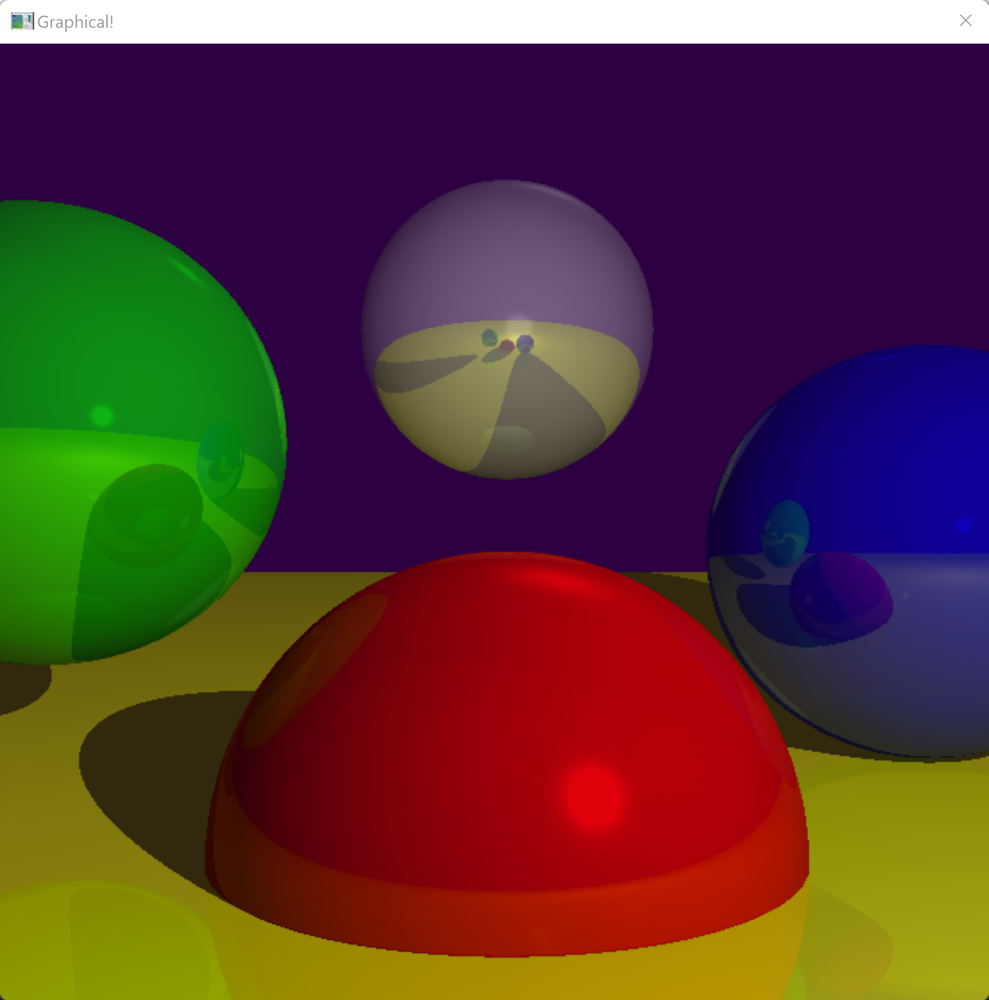

## What is this?
A rudimentary raytracer that I built from scratch. It uses the Win32 API to create a window and manually draws each pixel based on a simple scene. Currently it only renders spheres.

Features:
* Ambient, diffuse, and specular lights
* Shadows
* Reflections

Look at these beautiful shiny spheres:

## Can I run it?
[An executable](RayTracer.exe) is included in this repo if you just want to run that.

To compile, you only need a C++ compiler and the three source files: Source.cpp, Structs.h, and Vector3.cpp.

You can change the spheres (location, size, color, specular exponent, reflectiveness) or lights (type, intensity, location/direction)  by editing the corresponding array near the top of Source.cpp.

## References
_Computer Graphics from Scratch_ by Gabriel Gambetta

_Foundations of Game Engine Development Volume 2: Rendering_ by Eric Lengyel

https://www.falloutsoftware.com/tutorials/win/win1.htm